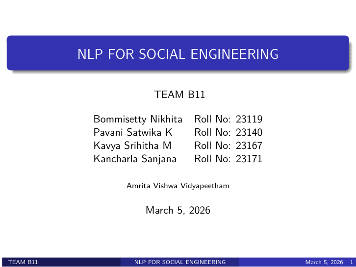
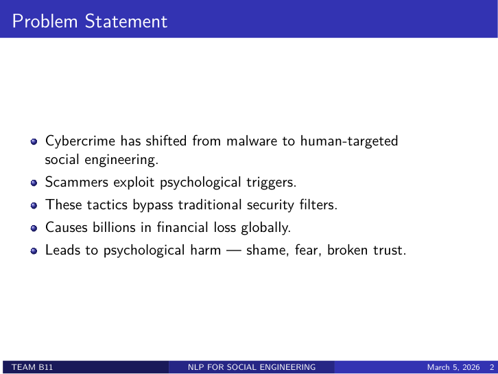
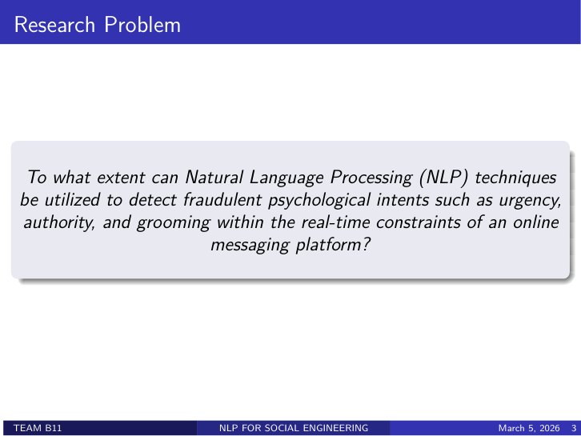

# Prism

Prism is an AI-powered messaging safety platform that helps users detect suspicious intent in conversations before they fall victim to scams. The system combines a React frontend, a FastAPI backend, and a transformer-based NLP pipeline to analyze messages for manipulative patterns such as urgency, authority bias, impersonation, and grooming-like behavior.

This project was developed as part of an NLP for Social Engineering study and is now presented as a complete demo application with chat, reporting, organization verification, and admin review features.

## Project overview

- Detects suspicious or manipulative message patterns using a transformer-based classifier
- Flags suspicious URLs, lookalike domains, and impersonation-style messaging
- Supports chat-based exchange with analysis results and consent controls
- Allows users to report suspicious conversations for admin review
- Includes organization registration and verified-organization workflows
- Provides an administration dashboard for reviewing reports, managing organizations, and inspecting vector database insights

## Presentation highlights

The project is grounded in a social-engineering NLP problem statement focused on identifying fraudulent psychological intent in real-time messaging.







## System architecture

- Frontend: React + Vite + Tailwind CSS + React Router
- Backend: FastAPI + Uvicorn + Pydantic
- AI / ML: Hugging Face Transformers + PyTorch + ChromaDB
- Data layer: SQLite for app data and Firebase Admin for authentication-related verification

## Repository structure

```text
.
├── app/
│   ├── backend/
│   │   ├── main.py
│   │   ├── config.py
│   │   ├── routes/
│   │   ├── services/
│   │   └── requirements.txt
│   └── frontend/
│       ├── package.json
│       ├── src/
│       └── vite.config.js
├── app/nlp_ppt.pdf
├── docs/screenshots/
├── production_chat_model/
├── production1_chat_model/
└── README.md
```

## Prerequisites

- Python 3.10+
- Node.js 18+
- npm
- A local copy of the model directory used by the backend

## Backend setup

```bash
cd app/backend
python -m venv .venv
source .venv/bin/activate   # Windows: .venv\Scripts\activate
pip install -r requirements.txt
```

Run the API server:

```bash
python main.py
```

The API will be available at:

- http://localhost:8000
- Swagger docs: http://localhost:8000/docs

### Backend notes

- The app expects a Firebase service account file at backend/serviceAccountKey.json for authentication-related verification.
- OTPs are generated in development mode and printed in the backend terminal.
- The backend creates a local SQLite database file automatically on first startup.

## Frontend setup

```bash
cd app/frontend
npm install
npm run dev
```

The frontend will be available at http://localhost:5173 by default.

## Environment variables

The backend can use these environment variables if provided:

- MODEL_PATH — path to the model directory
- DB_PATH — SQLite database location
- JWT_SECRET — secret used for issuing JWTs
- FIREBASE_SERVICE_ACCOUNT — path to the Firebase service account JSON
- VITE_API_URL — backend URL used by the frontend

## Development workflow

1. Start the backend first.
2. Start the frontend in a second terminal.
3. Open the frontend in the browser and sign in or register.
4. Use the reporting, chat, and admin features from the available UI screens.

## Screenshots included

The README now includes visual references from the presentation PDF stored at [app/nlp_ppt.pdf](app/nlp_ppt.pdf).

## Notes for contributors

- The project is structured for local development and demo purposes.
- Large model files and generated artifacts should be handled carefully during commits.
- For production use, the development OTP flow and hard-coded secret defaults should be replaced with a more secure configuration.

## License

This project is intended for academic and personal development use unless otherwise specified by the repository owner.
